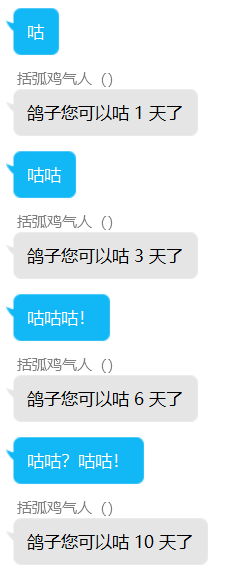
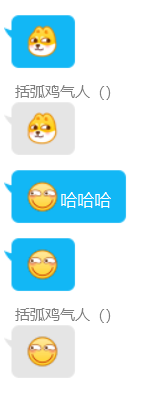
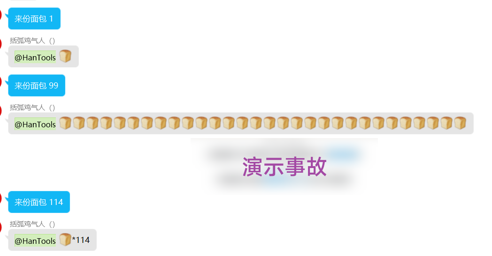
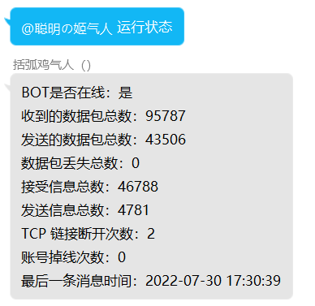
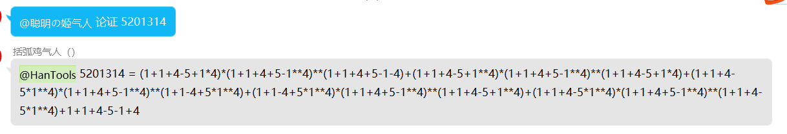

[如果你不想听我祖安和bb，那么你可以点击此处跳转正文](/?id=开始)

# 警告 _（使用协议）_
!> 开发者 **没有** 解答问题的义务<br>
如果你觉得开发者 **有义务** 解决问题那么你应该 **立刻** 踢出机器人并关闭此文档，不要去 **浪费时间** 了<br>
因 **用户** 导致的问题且 **无正当理由或态度不符** 那么开发者 **一律不予解决**<br>
不会用可以不用，憋在这理发店<br>
如果你使用了那么默认你同意了这个警告<br>

!> 如果你能跟一个机器人争起来的话那你也没必要用了<br>
本人不是什么闲着蛋疼的人，没有充分的时间维护他，纯业余爱好<br>
本身就是用爱发电的东西，没有任何收入渠道，维护也是要成本的<br>
不要认为我没有事做！不要认为维护没有成本！不要认为我有义务解决你的任何问题！

?> 最后开个玩笑<br>


<!--# 关于成本 _（祖安部分）_
那些他妈天天说这个不好那个不好的，你他妈怎么不自己做呢？<br>
我叼你马勒戈壁的，你他妈你没有手吗？<br>
觉得不好你干嘛要用这个啊！你他妈应该用那些更成熟、稳定的机器人，<br>
而不是逮着我这个天天上学好不容易闲下来还有妈的抽时间跟你们这群臭傻逼对骂！<br>
你觉得做这个不要钱，不要成本的是吧？那你应该比我做个更好的！<br>
你他妈天天的闲着没事跟我在这对骂，你他妈还不如好好练练你的技术<br>
还有那些想clone项目直接跑的，~~你给我1145.14我给你定制~~ 这代码自带混（屎）淆（山）你在想什么？<br>
如果你真有这个闲功夫你应该搞一个更好的机器人去圈钱！而不是跟我这个人去浪费你的时间！<br>

!> 本处无不良引导意思，就是纯纯的祖安

每年都要支出至少 **一千五（1500）** 才能维持其服务的 **正常运转**<br>
所以你知道了吗？他妈的维护要钱！妈的我对某些人来讲就是专业做这个的<br>
我要他妈的专业做这个我能做这么烂？一千五（1500）还他妈只是纯运营成本，还他妈没算上其他相关和不相关服务呢<br>
才九个月，花费成本1257.87元，要他妈给你看下腾讯云账单吗？一千五（1500）还只是保守估计<br>
按照现在这个成本下去，2000都不过分，我他妈跟你要钱了？妈的跟你们这群人讲话我都感觉我自己是个慈善家<br>
不知道做这个需要时间吗？需要花费精力吗？需要花费成本吗？<br>
你以为跟Scratch那么简单？如果真那么简单啊，我他妈也不会做这个了，早就做个牛逼的项目让你高攀不起了<br>
不知道我经历了多少挫折苦难？<br>
账号被封禁无数次，服务器一次有一次被莫名攻击，一次又一次跟你们废话和帮你们做乱七八糟的东西<br>
难道我维护不需要成本吗？试错不需要成本吗？服务器遭遇了无数次宕机难道我说什么了吗？不还是抢救、维护吗？<br>

?> 妈的算了。。。掰扯无数次了也没人看，直接说下成本让大家体会下罢：<br>
目前成本：（更新于2022/08，若无特殊说明，单位均为RMB/年）<br>
轻量应用云服务器：910（参考2022年618采购季价格）<br>
DDoS防护（10Gbps）：31（参考轻量防护包价格）<br>
主机安全：240（固定，每月20两台主机，参考轻量云的版本）<br>
COS存储：50（参考最近 5 月的平均成本）<br>
图片审核：150（估算，由于包含不可控因素且数据不足）<br>
域名相关：10（参考腾讯云2022年618采购季价格）<br>
合计：1391（RMB/年）
-->

# ~~打钱！~~
我！~~秦始皇 特朗普 rickroll 诈骗 24岁，事学生 homo 压力马斯内 括弧 逸一时误一世逸久逸久罢矣龄 鸡吧 屑 笨b SB 孤儿 你爹~~ 打钱！<br>
无聊算了下成本：<br>
表格更新时间：2022/09/03<br>

| 名称       | 成本（RMB/年） | 个数  | 备注/计算参考数据来源                                     | 用途                          |
|----------|-----------|-----|-------------------------------------------------|-----------------------------|
| 轻量云应用服务器 | 910       | 2 台 | 参考2022年618采购季价格                                 | 一台不够用所以买了两台（是的，很任性……        |
| DDoS防护   | 31        | 1 个 | 参考轻量防护包价格，10 Gbps，一台主机                          | 顾名思义咯……                     |
| 主机安全     | 240       | 2 个 | 普惠版，固定，每月20两台主机，参考轻量云的版本                        | 之前被打过，怎么死的都不知道……            |
| COS 存储   | 50        | 后付费 | 每月平均 4~5 RMB 左右                                 | 主要用于中转服务器文件，要不然大文件下载太慢      |
| 图片审核     | 80        | 后付费 | 估算，很努力的压成本了，但因为玄学因素无法估计每日平均用量（你也不知道你的群友会怎样抽风……） | 过滤涩图、违法、暴力图片 防止有的寄吧大半夜发恐怖图片 |
| 域名相关     | 10        | 1 个 | 专业版，参考腾讯云2022年618采购季价格                          | 域名解析，顾名思义                   |
| 合计       | 1321      | -   | 以上数据相加得到                                        | -                           |

!> 这个部分是想警告那些自己想拿来就用的人和那些喷子们，不知道做个这个有多难？

如果你真的自愿想赞助的话那么我为了不影响整个文档的观感所以我放到了 [文章最后：赞助](/?id=赞助)

# 这是个标题
?> 本文档使用 [Docsify](https://docsify.js.org/) 编写，文中会经常出现像这样的带链接的文字，不要怀疑我没放链接<br>

!> 机器人对符号尤为敏感，一个空格就是一个空格，不要多打也不要少打，发消息不要带回复！

!> \[xxx\] 表示可选参数，(xxx) 表示必填

?> 有问题小事 [Issue](https://github.com/daizihan233/Hanbot/issues) ，大事邮件 **hantools@duck.com** ，有QQ好友QQ说，没事儿别找我

# 开始

菜单调用方法：
```message
@机器人
```

## ~~help~~ _（已弃用，将在后续版本移除）_

就如他的名字一样，获取每个功能的用处即用法<br>

?> 语法：<br>
@机器人 help (xxx)<br>
@机器人 help<br>

语法一：查询某一个功能<br>
语法二：查询 help 用法

## 咕咕咕

娱乐性功能，语法参考下图，本质只是一个数字的无意义自增<br>



## 黑名单

!> 需要机器人的管理员

可以将一个人加黑到黑名单，没啥用，仅仅是加进去而已……<br>
类似自动踢出等偏定制性的功能可以找我

?> 语法：<br>
@机器人 黑名单 (QQ号: 数字)<br>
@机器人 黑名单 (@xxx)<br>

## 加群自动同意

用的人比较少…… 所以是直接写死在代码里的，后续版本会陆续支持直接使用消息控制

## 特定关键词复读

娱乐性功能<br>



像上面这样，复读的词可以用
```message
@机器人 help 特定关键词复读
```
查看

## 来份面包



就如上面这样<br>
面包会随着时间慢慢变多，1024个封顶

?> 语法自己看（

## 聊天

人工智障…… 非连续性聊天<br>

?> @机器人 (xxx)

## 祖安

!> 一小时最多使用五次

### 祖安我
让机器人骂你一句

### 祖安屑
同样是让机器人骂你一句。。。

### 祖安(@xxx)
让机器人骂被@的人一句

### 戳一戳
戳一戳机器人也会骂你一句

### 别骂我

!> 需要机器人管理

关闭此群祖安功能
### 快骂我

!> 需要机器人管理

开启此群祖安功能

## 申请管理员
找我就行，看那个干嘛（

!> 如果出现滥用开发者有权直接下掉你的权限

!> 审核相对较严，不一定 100% 通过

## 百度

?> @机器人 百度 (xxx)

机器人会发个网站<br>
让我帮您百度一下.gif

## 哔哩哔哩
和上面那个用法一样

## pi
娱乐性功能，让机器人 **估算** 一下Pi，~~当然从来没有准过~~<br>
~~据说可以拖慢机器人的服务器~~

## 突发恶疾
生成发病小作文

?> @机器人 突发恶疾 (xxx)

## 鸡汤
让机器人说一句心灵鸡汤，没什么用。。。

?> 鸡汤

## 运行状态
告诉你机器人现在运行得咋样，仍然没什么卵用（



?> @机器人 运行状态

## 禁言
!> 本功能属于 **可被滥用指令**<br>
**需要机器人管理员，操作者不必是群管理员**<br>
可能会造成滥用，如果发现滥用可以找我

!> 如果出现滥用开发者有权直接下掉你的权限

?> @机器人 禁言 (QQ号/@xxx) \[时长/分钟，默认 11 天 4 小时 51 分钟 4 秒\]

## 解禁

解除禁言，和上面那个禁言一样 属于 **可被滥用指令**，**需要机器人管理员**

## 论证
恶臭数字论证器，娱乐性

?> @机器人 论证 (xxx: 数字)



## 清屏
**需要机器人管理员权限**

!> 本功能属于 **可被滥用指令**<br>
可能会造成滥用，如果发现滥用可以找我

!> 如果出现滥用开发者有权直接下掉你的权限

发一堆换行，就清屏了（迫真

## 播放音乐

?> @机器人 播放音乐 \[xxx，默认网易云歌曲榜的TOP1\]

## 面包库存
查看面包库存，没啥用

## 给你面包
?> 语法见图


本功能对标点不敏感，所以出现标点不会使得其报错<br>
譬如 **114.514** 仍然会识别成 **114514**

## 删黑
删除黑名单，需要机器人管理员

## 主页
查询B站主页<br>
支持昵称检索和UID检索

?> 主页-(xxx/UIDxxx)

## 心理疏导
其实就是给你一堆号码而已（（（

## 我想自杀
出现类似的话语机器人会安慰你<br>
~~不过这好像没什么用吧~~

## 关键词撤回
!> 需要机器人管理员

?> @机器人 关键词撤回

自动判断开/关

?> @机器人 加新词 (xxx) <br>
@机器人 删词 (xxx)

加词与删词

## 图片审核
自动审核每一张图片

!> 本功能偏定制，请自己找开发者定制

政治敏感、色情、暴力、违法违规、广告、性感等图片可以自动撤回

### @机器人 safe (图片ID)
此功能用于将误判图片加白<br>
加白图片是不可能一劳永逸的（因为只是个缓存，而非永久存储），所以建议找开发者加进机器学习库中<br>

?> _**技术原因：**_ 纯色底色图片暂时无法加入机器学习库

### @机器人 clean (图片ID)
清除某张图片的缓存

### (From Redis, it's UNKNOW)
出现此提示表明这个图片的判定来源于数据库，所以属性未知<br>
~~好吧我承认是我偷懒没记~~

# 赞助
为了不影响观感，我把这个部分放在了最后<br>
这个部分我想了很久才放上来，不过呢也确实这个服务有点要生存不下去了<br>
当然，肯定有那些更好的机器人让你选择，这个项目纯个人开发，为了特定群而开发，受众原本就不是大众<br>
所以好好珍惜，没准哪天这个项目就没了 :|<br>
我也不想通过道德绑架的方式浪费你的时间，可是这些年来这个项目的费用完全由开发者一个人承担，再这样下去这个项目是没办法活的<br>
我也更不想用这种不道德的方式耗费你的钱财，所以最后提醒你一句：<br>

!> 你赞助之后不会获得任何的回报，所以说你不必为我而花钱，完完全全靠自愿，最后的最后：祝您生活愉快 :)

## 打钱？（卑微 Orz
下面有三张图片，但是不管我怎么调要么间距太大要么图片太大，没学过HTML，也不知道为啥……<br>


## 还有点废话：为什么最近不怎么更新迭代了？
开学了，自然这些东西就往后放了，不过我也没有放弃，<br>
这个项目我承诺如果没有不可抗力因素的影响，在我死之前都会一直维护！这句话永远保留与该文档最后一行